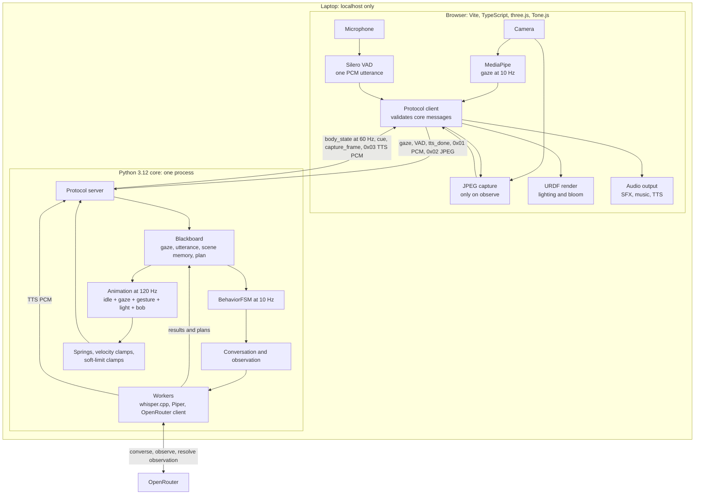

# Luxo — Technical Note

## 0. Status

Luxo is assembled as one working application: `core/main.py` constructs the
local speech models, OpenRouter client, scene memory, behaviour and observation
runtimes, animation loop, and protocol server; `run.sh` starts it with the Vite
renderer. There is no automated test suite; development relied on manual,
end-to-end checks. A live take still requires staged assets, browser permissions,
an available OpenRouter model, and environment-specific camera, microphone,
audio, and latency checks. The full application requires a paid OpenRouter API
key and a paid vision-capable model because the free models do not support image
input. Development and live testing used
`google/gemini-2.5-flash-lite:nitro`, which is the recommended model for testing
Luxo. Without `OPENROUTER_API_KEY`, conversation, image observation, and
model-directed behaviour do not work, so Luxo will not function as intended.

## 1. Architecture and data flow

The browser handles sensors, rendering, lighting, and audio. Python handles
speech, behaviour, scene memory, cloud-model calls, and animation decisions.
Keeping the sensors in the browser gives `getUserMedia` the same interface on
macOS and Ubuntu, removes the AVFoundation/V4L2/PortAudio layer, provides echo
cancellation, and puts face landmarking on the GPU instead of one of four scarce
CPU cores.

The browser never chooses a gesture, light preset, or joint value, and gaze
*dwell* is evaluated in the core, so behavioural logic sits on one side of the
socket. A worker completion callback only enqueues a generation-tagged result;
publication happens on the serialized tick, so animation never blocks on I/O.

Cloud reasoning has three typed boundaries. A visual dialogue turn makes
exactly one successful call at each boundary. `converse` receives the transcript,
up to three recent exchanges, compact
historical memory, and the latest privacy-filtered `currently_visible` facts;
it decides whether the plan ends in `observe`. `observe` alone carries one JPEG
and returns perception facts only. After Python commits those facts
and computes the deterministic missing set, `resolve_observation` receives the
typed origin, fresh facts, privacy-safe missing objects with stable IDs and
canonical names, current visible facts, compact memory, and recent dialogue;
it owns the final line and semantic plan.

## 2. Protocol

One socket at `ws://127.0.0.1:8765`. JSON uses text frames; binary frames carry a
1-byte type prefix (`0x01` utterance PCM, `0x02` JPEG, `0x03` TTS PCM), and
`ProtocolServer` solely owns `0x03`, so framing has one author. The schema is
defined once in `schema/messages.schema.json`, TypeScript types are generated
from it, and a check fails when the generated file has drifted.

The `capture_frame` JSON request carries an observation ID, but its returned
`0x02` JPEG contains only the type byte followed by the image. The core therefore
maps a JPEG to the one outstanding capture and rejects frames when no capture is
outstanding. One race cannot be resolved under this
wire format: a late frame from a cancelled capture that arrives while a newer
capture is outstanding is indistinguishable from the newer frame. Closing that
gap requires an acknowledged or request-tagged binary response.

## 3. The model-to-action boundary

The model emits plans over a closed eight-verb enum: `gesture`, `look_at`,
`light`, `sfx`, `scan`, `observe`, `posture`, `wait`. Joint angles are not part
of that interface.
The cloud model owns language interpretation, relevance, wording, and the
choice and order of those semantic actions. Python executes that decision
directly, with no local phrase, colour, object, or intent classifier rewriting
it.
Every duration, easing curve, joint split, overshoot magnitude, velocity clamp,
and limit check lives in the animation layer, unreachable by the model.

- The schema validator drops and logs a hallucinated verb.
- Joint-angle values have no path to the body.
- The animation layer enforces joint limits. Prompts do not participate in
  physical safety.

## 4. Scene memory and the missing-object comparison

Python handles absence detection because asking a VLM to compare two scenes can
produce invented differences. The model performs perception and response;
Python performs the comparison.

An `observe` prompt supplies stable prior IDs with canonical names and safe
attributes. The response is one `visible` list of at most 10 meaningful objects
ordered nearest-to-camera first. Each fact may match a prior stable ID;
`focus` identifies the fact that best answers the typed origin, while
`present_prior_ids` preserves presence evidence for prior objects that remain
visible but fall outside the nearest-first detail budget.

Python stores at most 10 objects. Current visible facts retain the model's
nearest-first order, then any spare slots are filled with the most recently
seen historical facts. Explicit prior matches preserve identity across label
drift. Python computes missing objects by stable ID against the snapshot
taken before capture, combining retained matches with valid presence evidence.
When a saturated response lacks trustworthy presence evidence, Python avoids
claiming that omitted lower-priority objects disappeared.

Python always gives `resolve_observation` the complete result, including an
empty missing set. The cloud decides whether the result is relevant, resolves
the dialogue turn or scene event that caused the observation, and returns the
final `say` and semantic plan. The local file is a versioned v2 envelope
containing `objects` and a monotonic `next_id`; legacy flat-list files migrate
on load without reusing IDs discarded by the 10-object bound. There are no
embeddings or vector search.

## 5. Privacy

Continuous gaze and hand landmarking stay in the browser; only derived sensor
measurements cross the local WebSocket. A frame leaves the machine only on an
explicit `observe` action. Dialogue observations are selected by the cloud
plan; a bounded hand-presentation scene event can also issue one. The renderer
validates the request and captures one JPEG. That scene image may include a
person or face, so observation is not anonymous. Continuous and incidental
camera streams stay local.

OpenRouter text calls receive transcript text, at most three recent exchanges,
compact memory, and present-only scene projections containing stable IDs,
canonical labels, and filtered attributes. `resolve_observation` additionally
receives the typed origin, filtered fresh facts, and Python-computed missing
objects as stable IDs with canonical names. Raw labels, bounding boxes,
timestamps, local presence metadata, gaze, joint angles, FSM state, telemetry,
clamps, and audio are excluded. The selected paid provider and model may permit
retention or training; use the implemented private profile when
zero-data-retention guarantees are required.

## 6. Physical reasoning and simulation

Each joint uses `ẍ = ω²(target − x) − 2ζω·ẋ`. The constants mirror the
URDF's velocity limits: the shoulder is capped at 0.95 rad/s and gets
ω=6.5/ζ=0.90 (lags visibly); the neck permits 1.60 rad/s and gets ω=14.0/ζ=0.62
(overshoots). The URDF's constraints produce the overlap and follow-through.
Output stage order is mandatory: sum → integrate → velocity clamp → soft-limit
clamp → emit. Commands clamp to soft limits; hard limits do not appear in that
module, and every clamp event is counted and exposed as telemetry.

> On real hardware this behaviour layer would emit setpoints to a deterministic
> C++ or Rust servo loop at 500 Hz with hard deadlines. In simulation the
> animation layer is the final stage before the transport, so Python is
> sufficient and the model/body boundary is unchanged. Soft joint limits and
> per-joint velocity limits from the URDF are enforced in the output stage and
> clamp events are counted, so the same constraint contract would hold against a
> physical actuator.

Look-at uses an analytic split: `base_yaw + neck_yaw = α`. The neck leads by
up to 0.5 rad and recentres on a 0.9 s constant, so overshoot lands on the neck.

## 7. Deployment

The deployment target is clean Ubuntu 24.04 with 4 cores, 8 GB, and no GPU.
Deployment uses `setup.sh`, a virtualenv, and npm, with no Docker at runtime. The
virtualenv is mandatory because PEP 668 blocks system pip on Noble. Python
requirements are pinned with hashes, whisper.cpp is built CPU-only from source,
and models are fetched to `~/.cache/luxo` with SHA256 verification. Model files
stay out of the repository.
Preflight splits in two: `doctor.py` checks core assets, configuration, local
resources, and optional OpenRouter reachability; `/selftest` exercises the
actual browser camera, microphone, WebGL, MediaPipe, audio, and WebSocket paths.
`localhost` is a secure context: no TLS and no LAN bind. `setup.sh`, `run.sh`,
the root README, and both preflight surfaces are present. A clean Ubuntu smoke
check remains outstanding.

## 8. Engineering trade-offs

### AI-assisted development

Most of the development was AI-assisted. A Claude agent acted as the
orchestrator, breaking the work into tasks and coordinating Codex agents running
`gpt-5.6-sol`. I wrote a strict PRD and detailed technical specification, and
the agents were instructed to follow both closely.

When implementation exposed a new constraint or changed a requirement, I
updated the orchestrator prompt and the relevant specification. The orchestrator
then delegated the follow-up changes to the Codex agents.

A lot of design work happened alongside the code. For motion, I used the
[Robots Fan viewer](https://viewer.robotsfan.com/) to load the URDF, adjust the
joints, and develop the base animations. I created
`robot/dormant_to_engaged.json` and `robot/engaged_to_inspecting.json` by hand in
that tool. The two files capture those base transitions.

### Automated tests

I did not use test-driven development or write an automated test suite for this
submission. Time was limited, so I spent it on the strongest end-to-end product
I could deliver: character behaviour, cloud vision, motion, audio, deployment,
and preflight tooling. I chose feature completeness and integration work over
test coverage for this task.

Regressions are harder to catch, refactoring is riskier, and the protocol,
scene-memory, and cancellation boundaries have only been exercised through
manual integration checks. I made this call for the submission deadline; tests
remain a major part of my day-to-day programming practice.

With more time, I would start with tests for schema and protocol validation,
plan execution, scene-memory identity and missing-object logic, cancellation
and generation handling, and configuration failures. I would then add browser
integration tests for capture, reconnects, and audio sequencing.

### Rejected alternatives

| Rejected | Reason |
|---|---|
| Local LLM/VLM | 4 cores, no GPU: 20–60 s/frame prefill, ~8–12 tok/s. |
| Python-side sensors | AVFoundation vs V4L2; reduces the browser to a display. |
| All-browser, no Python | WASM whisper/Piper slower; weakens Linux evidence. |
| Electron / Tauri | A build system for a tidiness problem. |
| Physics dynamics | Fights authored animation; authored overshoot is directable. |
| Next.js / shadcn | SSR and hydration add failure surface to one canvas. |
| Docker at runtime | Device passthrough is the dominant failure mode; costs RAM. |
| C++/Rust core | ~200 flops/tick; heavy compute already in compiled kernels. |

## 9. Development timeline

I spent roughly two hours planning before coding. That time went into writing
the PRD, the detailed technical specification, and the initial orchestrator
prompt.

Coding took roughly seven hours and ran almost back-to-back, apart from short
breaks to eat or step away. I iterated rapidly throughout those seven hours. As
the agents generated code, I ran the application live, fixed bugs and behaviour
problems as I found them, and worked on the sound effects and animations.

## 10. Measurements

`measurements/latency.csv` contains 72 completed spoken interactions. Each row
measures the path from local VAD end to the first synthesized audio chunk. The
figures below use linear-interpolated percentiles over all 72 rows.

| Required evidence | Result |
|---|---|
| Engagement reliability | Not recorded. The CSV contains no engagement trials, detection outcomes, precision, or recall. |
| Response latency | 3.401 s p50 and 8.512 s p95 end to end; 2.415 s minimum and 11.475 s maximum. |
| CPU | Not recorded. There are no CPU samples in the measurements directory. |
| Memory | Not recorded. There are no core or browser memory samples in the measurements directory. |

| Latency stage | p50 (ms) | Mean (ms) | p95 (ms) |
|---|---:|---:|---:|
| VAD end → PCM received | 0.04 | 0.07 | 0.25 |
| Transcription | 1,447.4 | 1,444.7 | 1,517.7 |
| Transcript → request sent | 99.9 | 99.8 | 102.9 |
| Model response | 811.7 | 1,111.5 | 1,744.9 |
| Response → first audio | 326.4 | 2,241.4 | 5,931.7 |
| End to end | 3,400.6 | 4,897.5 | 8,511.9 |

The long tail occurs mainly after the model response: response-to-first-audio
time rises from 326 ms at p50 to 5.932 s at p95, and 29 of 72 interactions took
more than one second in that stage. Median model usage was 1,807 input tokens and
40 output tokens.

The requested test endpoint was `google/gemini-2.5-flash-lite:nitro`. The CSV
records OpenRouter's returned model ID as `google/gemini-2.5-flash-lite`, without
the routing suffix, and records the application profile as `free`. These runs
were captured on macOS and do not establish performance on the Ubuntu target.

## 11. Known limitations

- The body has no roll DOF, so the classic sideways curious head-tilt is
  physically impossible. The shade cannot rotate about its optical axis, and
  faking it with `neck_yaw` + `head_pitch` reads as a broken gimbal. Curiosity
  is expressed as whole-body lean and crane, the same constraint that makes the
  lamp stoop to inspect something low. The character design accommodates the
  constraint.
- No full IK; no physics dynamics; single subject; no barge-in; no wake word
  (gaze is the signal); no cross-frame tracking (`observe` is discrete);
  localhost only.
- Returned JPEG frames carry no observation ID. A late frame from a cancelled
  capture can be claimed by a newer outstanding capture; §2 describes the wire
  constraint and the protocol change required to remove the race.
