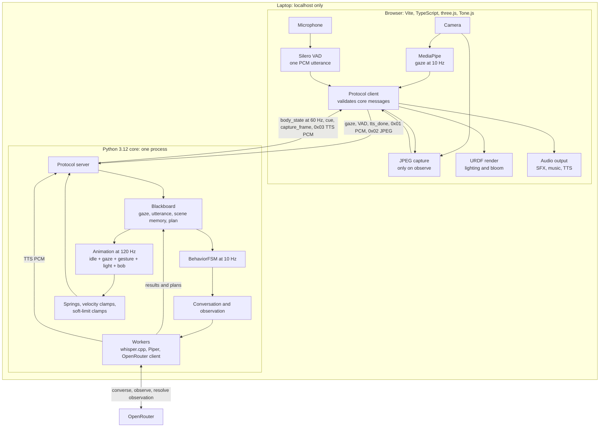

# Luxo — Technical Note

## 1. Architecture and data flow

Luxo runs as a browser renderer and one Python process. The browser handles the
camera, microphone, gaze/VAD, URDF render, lighting, and audio. Python handles
local speech, behaviour, scene memory, OpenRouter calls, and animation. One
local WebSocket at `ws://127.0.0.1:8765` connects them. Browser-side sensors
avoid separate macOS/Linux media stacks and use GPU-backed landmarking.

## 2. Protocol, model-to-action, and key choices

JSON uses WebSocket text frames. Binary frames start with one byte: `0x01` for
utterance PCM, `0x02` for JPEG, and `0x03` for synthesized speech PCM.
`schema/messages.schema.json` defines the protocol, generates renderer types,
and supports runtime validation.

A visual turn has three cloud calls. `converse` receives the transcript, three
recent exchanges, bounded memory, and filtered visible facts. It may request one
`observe` call, which sends one JPEG and returns facts. Python compares stable
object IDs, computes missing objects, and passes the result to
`resolve_observation` for the final line and plan. Memory is capped at 10 objects.
Continuous gaze and landmarks remain local; a frame leaves only for `observe`.

The model can emit `gesture`, `look_at`, `light`, `sfx`, `scan`, `observe`,
`posture`, and `wait`. Joint angles are outside the model interface. Validation
drops unknown verbs, while authored animation owns timing, easing, joint splits,
velocity limits, and soft limits.

| Key choice | Reason |
|---|---|
| Browser sensors | One media path on macOS and Ubuntu; landmarking uses the browser GPU. |
| Local whisper.cpp/Piper with cloud reasoning | Speech stays local; the 4-core, no-GPU target cannot run a useful local LLM/VLM at interactive speed. |
| Closed semantic plans | The model chooses intent while deterministic code retains physical control. |
| Python scene comparison | Stable IDs avoid VLM-invented differences between observations. |
| Native setup | Avoids Docker camera/audio passthrough and memory overhead. |

## 3. Simulation and deployment

Motion uses authored idle, gaze, gesture, light, and bob layers with no physics
simulation. A 120 Hz spring-damper stage applies the order sum, integrate,
velocity clamp, soft-limit clamp, emit. The shoulder is capped at 0.95 rad/s and
lags; the neck permits 1.60 rad/s and overshoots. Look-at uses an analytic yaw
split. Real hardware would move the same setpoints and limits into a
hard-deadline servo loop.

The target is Ubuntu 24.04, 4 cores, 8 GB RAM, and no GPU. `setup.sh` installs
pinned dependencies, builds CPU-only whisper.cpp, and downloads
checksum-verified models. `run.sh` starts the localhost core and renderer.
`doctor.py` checks the core; `/selftest` checks browser hardware and media paths.
Luxo requires a paid `OPENROUTER_API_KEY`. Testing used and recommends
`google/gemini-2.5-flash-lite:nitro` because free models lack image input.

## 4. AI-assisted development

Most development was AI-assisted. A Claude agent orchestrated Codex agents
running `gpt-5.6-sol`. I wrote a strict PRD and technical specification for them
to follow. When constraints changed, I updated the documents and orchestrator
prompt before it assigned follow-up work.

I developed sound and motion alongside the generated code. Using the
[Robots Fan viewer](https://viewer.robotsfan.com/), I adjusted the URDF joints
and created `robot/dormant_to_engaged.json` and
`robot/engaged_to_inspecting.json` by hand.

## 5. Development timeline

Planning took roughly two hours for the PRD, technical specification, and
orchestrator prompt. Coding took about seven hours, worked nearly back-to-back
apart from short breaks. I tested live throughout, fixed bugs as I found them,
and iterated on sound and animation while the agents generated code.

## 6. Testing trade-off

I deliberately skipped TDD and an automated test suite for this submission. The
seven-hour implementation window went into completing the interaction, testing
the application live, fixing integration bugs, and refining sound and animation.
That decision increases regression risk, especially around the protocol, scene
comparison, cancellation, and reconnect paths.

This was specific to the deadline. Tests remain a major part of my normal work.
The first additions would cover the protocol schema, plan executor, scene-memory
comparison, cancellation handling, and browser reconnects.

## 7. Measurements

The data contains 82 completed interactions, two engagement trials, and 170
one-second resource samples. All measurements came from macOS.

| Required evidence | Result |
|---|---|
| Engagement reliability | 2/2 acquisitions succeeded; median time to engage was 850 ms. The two-trial smoke check has no human-labelled ground truth, failures, or disengagement trials, so it cannot measure precision/recall. |
| Response latency | VAD-end to first audio was 3.401 s p50 and 8.520 s p95 (range 2.415–11.475 s). Response-to-first-audio caused most of the tail: 317 ms p50 and 5.942 s p95. |
| CPU | 9.91% mean, 19.71% p95, 37.72% maximum, relative to one logical CPU on a 10-logical-CPU machine. |
| Memory | 294.19 MB peak Python-core RSS. Browser memory was not recorded. macOS used peak `getrusage` RSS, so current RSS is unavailable. |

The endpoint requested during testing was
`google/gemini-2.5-flash-lite:nitro`. Resource sampling covered 171.1
seconds. These figures do not establish Ubuntu performance.

## 8. Known limitations

- The five-DOF body has no roll axis. Motion has no full IK or physics.
- One subject, no wake word, no barge-in, and no cross-frame tracking.
  Observations are discrete JPEGs.
- JPEG frames carry no observation ID. A late cancelled frame can be mistaken
  for a newer capture; the protocol needs tagged or acknowledged binary replies.
- The complete experience depends on paid OpenRouter access. Observation images
  may contain faces, and provider retention depends on the selected profile.
- No clean Ubuntu smoke test or automated suite has run. Engagement has two
  positive trials, browser memory is unmeasured, and all data came from macOS.
